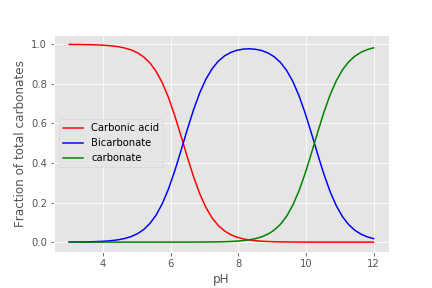

# Third-party imports
- import numpy as np
- import pandas as pd
- import matplotlib.pyplot as plt
- import matplotlib

# AIDE imports
- import aide_design
- import aide_design.pipedatabase as pipe
- from aide_design.units import unit_registry as u
- from aide_design import physchem as pc
- import aide_design.expert_inputs as exp
- import aide_design.materials_database as mat
- import aide_design.utility as ut
- import aide_design.k_value_of_reductions_utility as k
- import aide_design.pipeline_utility as pipeline
- import warnings

### Carbonate Chemistry
Carbonic acid and bicarbonate
$${H_2}CO_3^* \overset {K_1} \longleftrightarrow {H^+} + HCO_3^- $$

$${K_1} = \frac{{\left[ {{H^ + }} \right]\left[ {HCO_3^ - } \right]}}{{\left[ {{H_2}CO_3^* } \right]}}$$
$$p{K_1} = 6.3$$

bicarbonate and carbonate
$$HCO_3^ - \overset {{K_2}} \longleftrightarrow {H^ + } + CO_3^{ - 2}$$
$${K_2} = \frac{{\left[ {{H^ + }} \right]\left[ {CO_3^{ - 2}} \right]}}{{\left[ {HCO_3^ - } \right]}}$$
$$p{K_2} = 10.3$$

Total concentration of carbonates
$${C_T} = \left[ {{H_2}CO_3^* } \right] + \left[ {HCO_3^ - } \right] + \left[ {CO_3^{ - 2}} \right]$$

Alpha notation
$$\left[ {{H_2}CO_3^* } \right] = {\alpha_0}{C_T}$$
$$\left[ {HCO_3^ - } \right] = {\alpha_1}{C_T}$$
$$\left[ {CO_3^{ - 2}} \right] = {\alpha_2}{C_T}$$

Acid Neutralizing Capacity (ANC)
$${\text{ANC}} = [HCO_3^ - {\text{] + 2[CO}}_3^{ - 2}{\text{] + [O}}{{\text{H}}^{\text{ - }}}{\text{] - [}}{{\text{H}}^{\text{ + }}}{\text{]}}$$
ANC in alpha notation
$$ANC = {C_T}({\alpha_1} + 2{\alpha_2}) + \frac{{{K_w}}}{{\left[ {{H^ + }} \right]}} - \left[ {{H^ + }} \right]$$

Alphas
Alpha0
$${\alpha_{\text{0}}} = \frac{1}{{1 + \frac{{{K_1}}}{{[{H^ + }]}} + \frac{{{K_1}{K_2}}}{{{{[{H^ + }]}^2}}}}}$$

$${\alpha_{\text{0}}} = \frac{1}{{1 + \frac{{{K_1}}}{{[{H^ + }]}}\left( {1 + \frac{{{K_2}}}{{[{H^ + }]}}} \right)}}$$

$${\alpha_{\text{1}}}  =  \frac{1}{{\frac{{[{{\rm H}^ + }]}}{{{{\rm K}_1}}} + 1 + \frac{{{{\rm K}_2}}}{{[{{\rm H}^ + }]}}}}$$
$${\alpha_{\text{2}}}  =  \frac{1}{{\frac{{{{[{{\rm H}^ + }]}^2}}}{{{{\rm K}_1}{{\rm K}_2}}} + \frac{{[{{\rm H}^ + }]}}{{{{\rm K}_2}}} + 1}}$$

$${\alpha_{\text{2}}}  =  \frac{1}{{1 + \frac{{[{{\rm H}^ + }]}}{{{{\rm K}_2}}}\left( {1 + \frac{{[{{\rm H}^ + }]}}{{{{\rm K}_1}}}} \right)}}$$

closed to the atmosphere
$$ANC = {C_T}({\alpha _1} + 2{\alpha _2}) + \frac{{{K_w}}}{{\left[ {{H^ + }} \right]}} - \left[ {{H^ + }} \right]$$
open to the atmosphere
$$ANC = \frac{{{P_{C{O_2}}}{K_H}}}{{{\alpha_0}}}({\alpha_1} + 2{\alpha_2}) + \frac{{{K_w}}}{{\left[ {{H^ + }} \right]}} - \left[ {{H^ + }} \right]$$

```python
from aide_design.play import *
import Environmental_Processes_Analysis as EPA
# The following two lines of code are needed if the EPA code is edited and you want to force a reload
# import importlib
# importlib.reload(EPA)
```
Let's plot the alphas for the carbonate system to show the relative importance of the three species!
```python
# Create a uniform spaced array from 3 to 12
pH_graph = np.linspace(3,12,50)
plt.plot(pH_graph, EPA.alpha0_carbonate(pH_graph),'r', pH_graph, EPA.alpha1_carbonate(pH_graph),'b',pH_graph, EPA.alpha2_carbonate(pH_graph),'g')
plt.xlabel('pH')
plt.ylabel('Fraction of total carbonates')
plt.legend(['Carbonic acid', 'Bicarbonate', 'carbonate'])

plt.savefig('images/alphagraph.png')
plt.show()
```

The alpha terms representing the carbonate species are shown in Figure 1.
 

Figure 1. Carbonate species relative importance as a function of pH.

```Python
pH_graph = np.linspace(5,7,50)
plt.plot(pH_graph, EPA.ANC_open(pH_graph),'r')
plt.xlabel('pH')
plt.ylabel('ANC (mole/L)')
#plt.yscale('log')
plt.savefig('images/ANCgraph.png')
plt.show()
```
Figure 2 shows the ANC as a function of pH for a system that is in equilibrium with the atmosphere.
 

 Figure 2. ANC as a function of pH in a system in equilibrium with the atmosphere.

```Python
import scipy
from scipy import optimize

# Strip the units off of the ANC function so that scipy can calculate the root. Scipy is not yet compatible with units.
def ANC_open_unitless(pH):
  return (EPA.ANC_open(pH)).magnitude
#Now we can find the pH of pure water by using a root finding algorithm.
def pH_open():
  return optimize.brentq(ANC_open_unitless, 1, 12)

print('The pH of pure water in equilibrium with the atmosphere is', pH_open())
```
