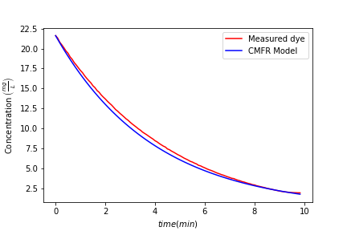

## Steps

```python
from aguaclara.core.units import unit_registry as u
import aguaclara.research.environmental_processes_analysis as epa
import numpy as np
import pandas as pd
import matplotlib.pyplot as plt

#The following file is from a CMFR
data_file_path = 'https://raw.githubusercontent.com/monroews/CEE4530/master/Examples/data/CMFR_example.xls'

# find the row after the last note in the file. This assumes that the last note marks the beginning of the test.
firstrow = epa.notes(data_file_path).last_valid_index() + 1

firstrow = firstrow + 10
#I eliminate the beginning of the data file because this is a CMFR and the first data was taken before the dye reached the sensor.

time_data = (epa.column_of_time(data_file_path,firstrow,-1)).to(u.s)

concentration_data = epa.column_of_data(data_file_path,firstrow,1,-1,'mg/L')

V_CMFR = 1.5*u.L
Q_CMFR = 380 * u.mL/u.min

#here we set estimates that we will use as starting values for the curve fitting
theta_guess = (V_CMFR/Q_CMFR).to(u.s)


C_bar_guess = np.max(concentration_data)

#The Solver_CMFR_N will return the initial tracer concentration, residence time, and number of reactors in series.
#This experiment was for a single reactor and so we expect N to be 1!
CMFR = epa.Solver_CMFR_N(time_data, concentration_data, theta_guess, C_bar_guess)
#use dot notation to get the 3 elements of the tuple that are in CMFR.
CMFR.C_bar
CMFR.N
CMFR.theta
#create a model curve given the curve fit parameters.
#
CMFR_model = CMFR.C_bar * epa.E_CMFR_N(time_data/CMFR.theta,CMFR.N)
plt.plot(time_data.to(u.min), concentration_data.to(u.mg/u.L),'r')
plt.plot(time_data.to(u.min), CMFR_model,'b')

plt.xlabel(r'$time (min)$')
plt.ylabel(r'Concentration $\left ( \frac{mg}{L} \right )$')
plt.legend(['Measured dye','CMFR Model'])
plt.savefig('Examples/images/reactorplot.png')
plt.show()

#Load a data file for a reactor with baffles.

data_file_path = 'https://raw.githubusercontent.com/monroews/CEE4530/master/Examples/data/Dispersion_example.xls'
firstrow = epa.notes(data_file_path).last_valid_index() + 1
time_data = (epa.column_of_time(data_file_path,firstrow,-1)).to(u.s)
concentration_data = epa.column_of_data(data_file_path,firstrow,1,-1,'mg/L')
V_CMFR = 2.25*u.L
Q_CMFR = 380 * u.mL/u.min
theta_guess = (V_CMFR/Q_CMFR).to(u.s)
C_bar_guess = np.max(concentration_data)/2
#use solver to get the CMFR parameters
CMFR = epa.Solver_CMFR_N(time_data, concentration_data, theta_guess, C_bar_guess)
CMFR.C_bar
CMFR.N
CMFR.theta.to(u.s)
#Create the CMFR model curve based on the solver parameters
#We do this with dimensions so that we can plot both models and the data on the same graph. If we did this in dimensionless it wouldn't be possible to plot everything on the same plot because the values used to create dimensionless time and dimensionless concentration are different for the two models.
CMFR_model = (CMFR.C_bar*epa.E_CMFR_N(time_data/CMFR.theta, CMFR.N)).to(u.mg/u.L)

#use solver to get the advection dispersion parameters
AD = epa.Solver_AD_Pe(time_data, concentration_data, theta_guess, C_bar_guess)
AD.C_bar
AD.Pe
AD.theta

#Create the advection dispersion model curve based on the solver parameters
AD_model = (AD.C_bar*epa.E_Advective_Dispersion((time_data/AD.theta).to_base_units(), AD.Pe)).to(u.mg/u.L)

#Plot the data and the two model curves.
plt.plot(time_data.to(u.s), concentration_data.to(u.mg/u.L),'r')
plt.plot(time_data.to(u.s), CMFR_model,'b')
plt.plot(time_data.to(u.s), AD_model,'g')
plt.xlabel(r'$time (min)$')
plt.ylabel(r'Concentration $\left ( \frac{mg}{L} \right )$')
plt.legend(['Measured dye','CMFR Model', 'AD Model'])
plt.savefig('Examples/images/reactorplot.png')
plt.show()

```

