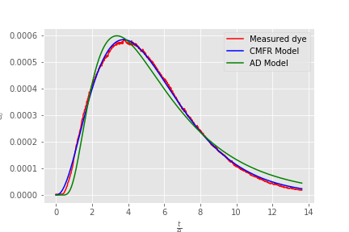

# Third-party imports
- import numpy as np
- import pandas as pd
- import matplotlib.pyplot as plt
- import matplotlib

# AIDE imports
- import aide_design
- import aide_design.pipedatabase as pipe
- from aide_design.units import unit_registry as u
- from aide_design import physchem as pc
- import aide_design.expert_inputs as exp
- import aide_design.materials_database as mat
- import aide_design.utility as ut
- import aide_design.k_value_of_reductions_utility as k
- import aide_design.pipeline_utility as pipeline
- import warnings

## Steps

```python
from aide_design.play import *
import Environmental_Processes_Analysis as EPA
import importlib
importlib.reload(EPA)

#The following file is from a CMFR
data_file_path = 'Lab5Part2(CMFR_Final).xls'
print(EPA.notes(data_file_path))

#I eliminate the beginning of the data file because this is a CMFR and the first data was taken before the dye reached the sensor.
firstrow = 50
time_data = EPA.ftime(data_file_path,firstrow,-1)
concentration_data = EPA.Column_of_data(data_file_path,firstrow,-1,1,'mg/L')
V_CMFR = 1.5*u.L
Q_CMFR = 380 * u.mL/u.min

#here we set estimates that we will use as starting values for the curve fitting
theta_guess = (V_CMFR/Q_CMFR).to(u.s)

C_bar_guess = np.max(concentration_data)

#The Solver_CMFR_N will return the initial tracer concentration, residence time, and number of reactors in series.
#This experiment was for a single reactor and so we expect N to be 1!
CMFR = EPA.Solver_CMFR_N(time_data, concentration_data, theta_guess, C_bar_guess)
#use dot notation to get the 3 elements of the tuple that are in CMFR.
CMFR.C_bar
CMFR.N
CMFR.theta
#create a model curve given the curve fit parameters.
#
CMFR_model = CMFR.C_bar * EPA.E_CMFR_N(time_data/CMFR.theta,CMFR.N)
plt.plot(time_data.to(u.min), concentration_data.to(u.mg/u.L),'r')
plt.plot(time_data.to(u.min), CMFR_model,'b')

plt.xlabel(r'$time (min)$')
plt.ylabel(r'Concentration $\left ( \frac{mg}{L} \right )$')
plt.legend(['Measured dye','CMFR Model'])

plt.savefig('images/reactorplot.png')
plt.show()

#Load a data file for a reactor with baffles. This was from a test that used acid as the tracer.
#The concentration units are moles/L

data_file_path = 'Advection_dispersion.txt'
firstrow = 0
time_data = EPA.ftime(data_file_path,firstrow,-1)
concentration_data = EPA.Column_of_data(data_file_path,firstrow,-1,1,'mole/L')
V_CMFR = 1.5*u.L
Q_CMFR = 380 * u.mL/u.min
theta_guess = (V_CMFR/Q_CMFR).to(u.s)
theta_guess
C_bar_guess = np.max(concentration_data)

#use solver to get the CMFR parameters
CMFR = EPA.Solver_CMFR_N(time_data, concentration_data, theta_guess, C_bar_guess)
CMFR.C_bar
CMFR.N
CMFR.theta.to(u.min)
#Create the CMFR model curve based on the solver parameters
CMFR_model = (CMFR.C_bar*EPA.E_CMFR_N(time_data/CMFR.theta, CMFR.N)).to(u.mole/u.L)

#use solver to get the advection dispersion parameters
AD = EPA.Solver_AD_Pe(time_data, concentration_data, theta_guess, C_bar_guess)
AD.C_bar
AD.Pe
AD.theta.to(u.min)
#Create the advection dispersion model curve based on the solver parameters
AD_model = (AD.C_bar*EPA.E_Advective_Dispersion((time_data/AD.theta).to_base_units(), AD.Pe)).to(u.mole/u.L)

#Plot the data and the two model curves.
plt.plot(time_data.to(u.min), concentration_data.to(u.mole/u.L),'r')
plt.plot(time_data.to(u.min), CMFR_model,'b')
plt.plot(time_data.to(u.min), AD_model,'g')
plt.xlabel(r'$time (min)$')
plt.ylabel(r'Concentration $\left ( \frac{mg}{L} \right )$')
plt.legend(['Measured dye','CMFR Model', 'AD Model'])

plt.savefig('images/reactorplot.png')
plt.show()

```

